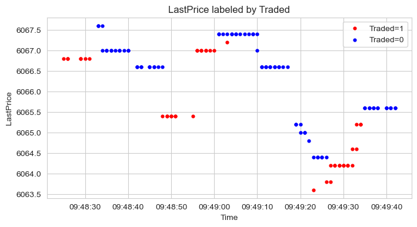
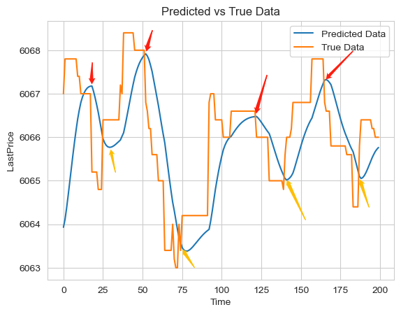
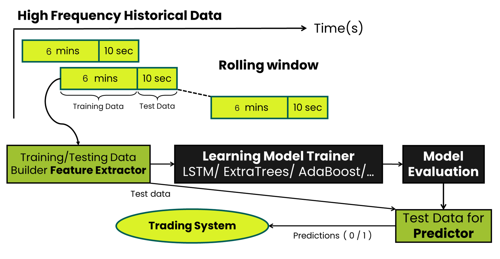
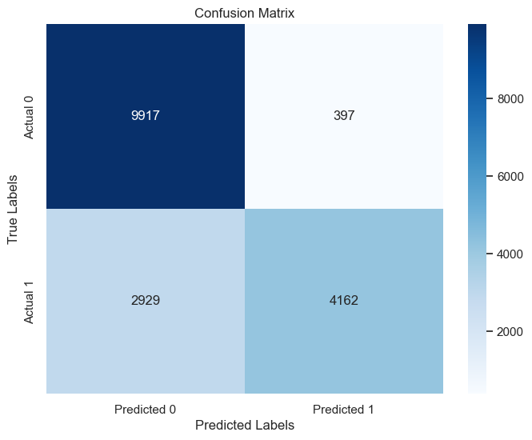
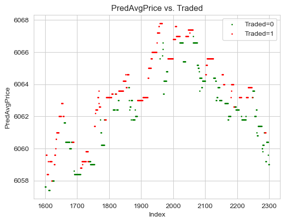
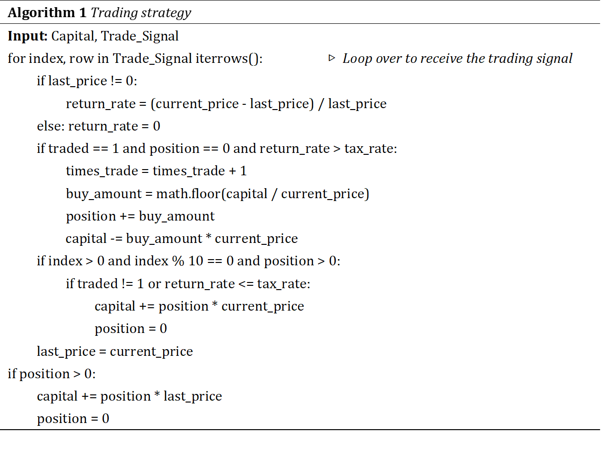

# Predicting the Short-term Direction of Futures Contracts through Machine Learning  

Predicting the short-term directional movement of futures contracts is a formidable task due to their pricing complexity, which is influenced by various dynamic conditions. This research introduces an innovative approach to forecast the short-term directional movements of underlying futures contracts. We devise a set of features derived from order book data and traded price time series. Two prediction models are constructed using lightGBM with LSTM, and the final trading signals are predicted by integrating learning strategies. Our models are trained on the CSI 500 stock index futures (IC2305) listed on the Shanghai Futures Exchange, yielding an accuracy of 0.613 in predicting directional changes within specific periods. Furthermore, when simulating single-day data with a tax rate of 1/10,000, we achieved a daily profit of approximately 0.1  

## Dataset

We use our own software to crawl the CSI 500 index futures

## Target

Predicting High Frequency Futures Trading Signals.

Try to take full positions at the lows and short positions at the highs.

## Pipline

## Model Evaluation

## Trading Strategy

